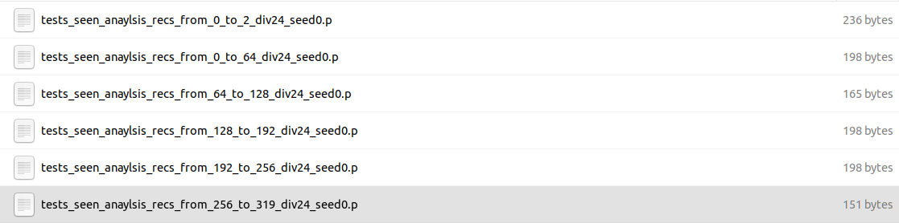

# CAPEAM

<a href="https://bhkim94.github.io/projects/CAPEAM/">  <b>Context-Aware Planning and Environment-Aware Memory for Instruction Following Embodied Agents </b> </a>
<br>
<a href="https://bhkim94.github.io/">Byeonghwi Kim</a>,
<a href="https://wild-reptile-5c4.notion.site/Jinyeon-Kim-s-Portfolio-page-ef855010f6c445488ad6969ed7cda11f?pvs=4">Jinyeon Kim</a>,
<a href="https://uyeongkim.github.io/">Yuyeong Kim</a>,
<a href="https://mch0916.github.io/">Cheolhong Min</a>,
<a href="http://ppolon.github.io/"> Jonghyun Choi </a>
<br>
<a href="https://iccv2023.thecvf.com/"> ICCV 2023 </a>

<p align="center">
  🏆 <b>Challenge Winners</b> 🏆
  <br>
  <a href="https://askforalfred.com/EAI23/">1st Generalist Language Grounding Agents Challenge (CVPRW'23)</a>
</p>

**CAPEAM** (Context-Aware Planning and Environment-Aware Memory) is an embodied instruction following agent that incorporates semantic context (e.g., appropriate objects to interact with) in a sequence of actions and maintains the changed spatial arrangement and states of interacted objects (e.g., location that the object has been moved to) in inferring the subsequent actions.

We note that our code is largely built upon <a href="https://github.com/soyeonm/FILM">FILM</a>.

<p align="center">
  
</p>

## Environment

### Clone our repo
```
git clone https://github.com/snumprlab/capeam
cd capeam
```
### Install requirements
```
conda create -n capeam python=3.6
conda activate capeam
$ pip install -r requirements.txt
```

### Install habitat-lab
```
git clone https://github.com/facebookresearch/habitat-lab.git
cd habitat-lab; git checkout tags/v0.1.5; 
pip install -e .
```

### Install PyTorch
Install PyTorch from <a href="https://pytorch.org/get-started/previous-versions/#v1100">the official PyTorch site</a>
```
conda install pytorch==1.8.0 torchvision==0.9.0 cudatoolkit=11.1 #(Linux with GPU)
```

### [Optional] Install Detectron2
If you want to visualize the semantic segmentation output, install [detectron2](https://github.com/facebookresearch/detectron2/).
```
python -m pip install detectron2 -f https://dl.fbaipublicfiles.com/detectron2/wheels/cu102/torch1.6/index.html #(Linux with GPU)
CC=clang CXX=clang++ ARCHFLAGS="-arch x86_64" python -m pip install 'git+https://github.com/facebookresearch/detectron2.git' #(Mac OS)
```

## Pretrained Model
Follow the instructions in the <a href="https://github.com/soyeonm/FILM?tab=readme-ov-file#download-trained-models">FILM</a> repo to download and put the pretrained weights on the right paths.<br />
Additionally, download maskrcnn weight for the sliced object from <a href = "https://drive.google.com/file/d/1FbM9hxr562a5T8OQSwr_1Hww2eI9QeRh/view?usp=sharing">this link</a>.

## Model Inference

### Run visual display for headless evaluation (Optional)
If you don't have a monitor (*i.e.*, headless), run the script below to make a headless display with the number `<DISPLAY_NUM>` (e.g., `1`).
```
python alfred_utils/scripts/startx.py <DISPLAY_NUM> &
export DISPLAY=:<DISPLAY_NUM>
```

### Run main

To reproduce our model, run the command below. <br />
**Note:** To use templated actions, add `--templated` in the command. <br />
**Note:** To use low-level instructions, add `--appended` in the command.
```
$ python main.py --max_episode_length 1000 --num_local_steps 25 --num_processes 1 --eval_split tests_unseen --from_idx 121 --to_idx 123 --max_fails 10 --debug_local --learned_depth --set_dn fist_run --use_sem_seg --use_sem_policy --which_gpu 0 --sem_gpu_id 0 --sem_seg_gpu 0 --depth_gpu 0 --x_display 1 -v 1 --seed 2 --appended --templated
```
For more details of the arguments, kindly refer to the "Arguments" paragraph in <a href="https://github.com/soyeonm/FILM?tab=readme-ov-file#run-film-on-valid-tests-sets">Run FILM on Valid/ Tests Sets</a>.

## How to see your evaluation results of the validation sets
The output of your runs is saved in the pickles of "results/analyze_recs/".



To see evaluation results from the validation sets, run the command below.
```
python val_sr.py
```
Aggregate results over multiple runs if you need to.

## How to get your evaluation results of the test sets in [leaderboard](https://leaderboard.allenai.org/alfred/submissions/public)

Run the command below.

```
$ python3 utils/leaderboard_script.py --dn_startswith WHAT_YOUR_PICKLES_START_WITH --json_name DESIRED_JSON_NAME
```

For example, if the "ls" of "results/leaderboard/" looks like you can run the command below.


```
$ python3 utils/leaderboard_script.py --dn_startswith div24_seed0 --json_name div24_seed0
```
The json file is generated in "leaderboard_jsons/"; upload this to the leaderboard.

## Acknowledgement
```
This work is partly supported by the NRF grant (No.2022R1A2C4002300) 20%, IITP grants (No.2020-0-01361, AI GS Program (Yonsei University) 5%, No.2021-0-02068, AI Innovation Hub 5%, 2022-0-00077 10%, 2022-0-00113 10%, 2022-0-00959 10%, 2022-0-00871 20%, 2022-0-00951 20%) funded by the Korea government (MSIT).
```

### Citation
```
@inproceedings{kim2023context,
  author    = {Kim, Byeonghwi and Kim, Jinyeon and Kim, Yuyeong and Min, Cheolhong and Choi, Jonghyun},
  title     = {Context-Aware Planning and Environment-Aware Memory for Instruction Following Embodied Agents},
  booktitle = {ICCV},
  year      = {2023},
}
```
